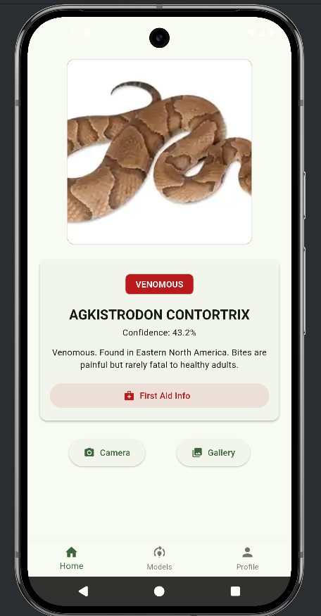
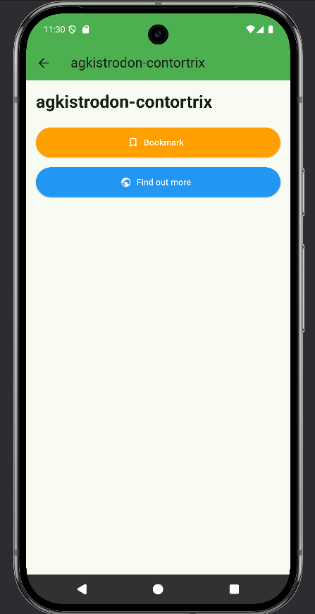
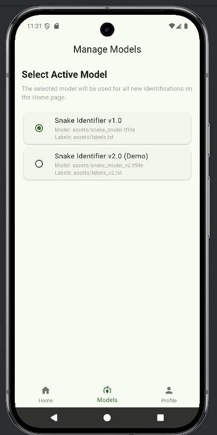
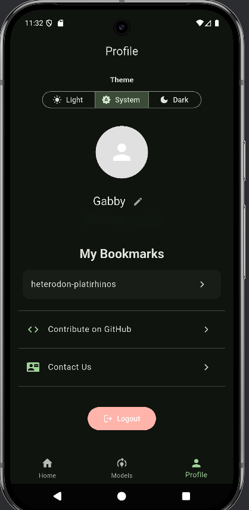

  
  
  

# 🐍 Snake Identifier App

An open-source mobile application built with Flutter to identify snake species using an on-device TensorFlow Lite model. Snap a picture, get an ID, and save your findings!

## ✨ Features

* 📸 **Image Classification**: Identify snake species (up to 35 different species) using your Camera or Gallery.

* 🧠 **On-Device ML**: Utilizes a built-in TFLite model for fast, offline classification.

* 👤 **User Accounts**: Secure login and signup powered by Firebase Authentication.

* 🔖 **Bookmarking**: Save interesting identifications to your personal profile, powered by Cloud Firestore.

* **🎨 Customization:**

    * Change your display name.
    * Toggle between Light, Dark, and System themes.

* **🐍 Model Management**: A functional page to switch between different ML models bundled locally with the app.

* **ℹ️ Details Page**: View more info on an identified snake and tap a button to search for it on National Geographic.

* **🔗 Helpful Links**: A profile page with links to the project's GitHub and a contact email.

## 📱 Screenshots

A quick look at the app in action.

   
Home (Classifier)

  
  
Details & Bookmarking

  
  
Model Management

  
  
Profile Page (Dark Mode)

  

## 🛠️ Tech Stack

This project is built with Flutter and Firebase, using modern state management and on-device ML.

* **Framework:** [Flutter](https://flutter.dev/)
* **Backend & Database:** [Firebase](https://firebase.google.com/)
    * **Firebase Authentication:** For user login/signup.
    * **Cloud Firestore:** For saving user bookmarks and display names.
* **Machine Learning:** TensorFlow Lite (via the `tflite_flutter` package)
* **State Management:** Provider (for managing the active theme and active model)
* **Key Packages:**
    * `image_picker`
    * `url_launcher`
    * `cloud_firestore`
    * `firebase_auth`

## 🚀 Getting Started

To get a local copy up and running, follow these simple steps.

## Prerequisites

* You must have the [Flutter SDK](https://flutter.dev/docs/get-started/install) installed.

* An Android Emulator, iOS Simulator, or physical device.

* A code editor (like VS Code or Android Studio).

## Installation & Setup

1. **Fork the Project** Click the "Fork" button in the top-right of this page.
2. **Clone Your Fork**

`git clone [https://github.com/Gabby-01-K/snake-identifier.git](https://github.com/Gabby-01-K/snake-identifierv.git)
 cd snake-identifier`

3. **Install Flutter Dependencies**

`flutter pub get`

4. **Set Up Firebase** This project requires Firebase to run.

* Go to the [Firebase Console](https://console.firebase.google.com/) and create a new project.
  .  
  Follow the [FlutterFire CLI setup instructions](https://www.google.com/search?q=https://firebase.google.com/docs/flutter/setup%3Fplatform%3Dflutter) to connect your app to this Firebase project.

* **Enable Firebase Services:**

    1. Go to **Authentication** -> **Sign-in method** and enable **Email/Password**.

    2. Go to **Firestore Database** -> **Create database**. Start in **Test Mode** (or with proper security rules).

* **Run the app!**

`flutter run`

## 🗺️ Future Roadmap

This project is a great foundation. Here are some features planned for the future:

* [ ] **Firebase Storage Integration:** The original plan to allow users to upload their own custom profile pictures.

* [ ] **Model Downloads:** Host models on Firebase Storage and allow users to download new/updated versions from the "Models" page.

* [ ] **Better Snake Details:** Integrate with a proper API (like iNaturalist or a dedicated biology API) to show scientific names, habitat maps, and more.

## 🤝 How to Contribute

**Contributions are welcome!** For guidelines, please see our [Contributing Guide](CONTRIBUTING.md).

📜 License

This project is licensed under the MIT License. See the `LICENSE` file for details.
